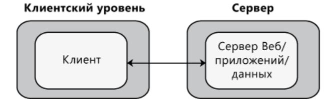
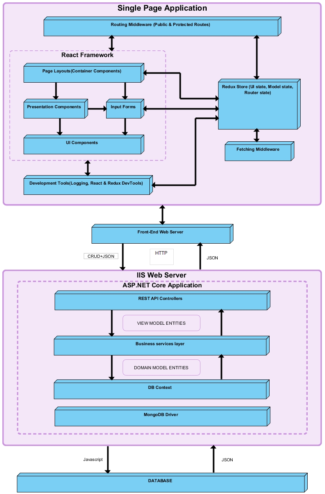
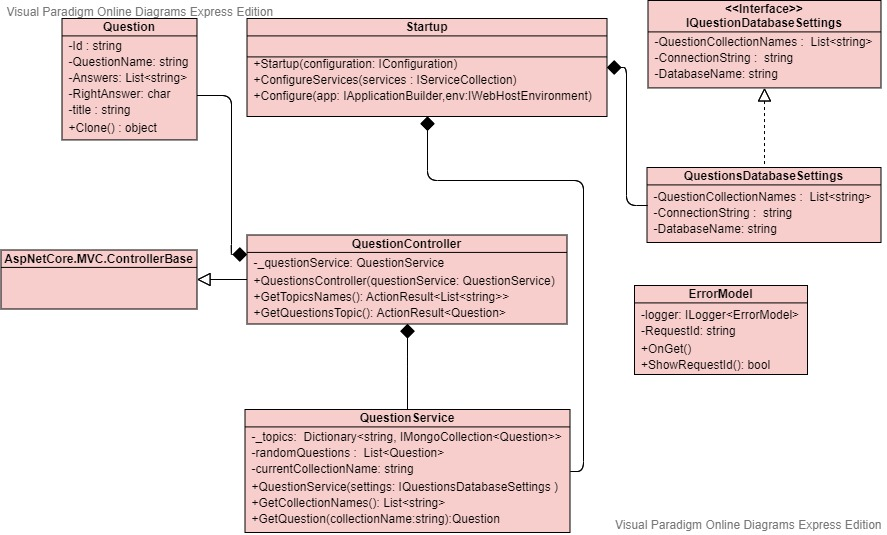

## Исследование архитектурного решения

### Содержание

1. [Часть 1 - Проектирование архитектуры](#chapter_1)  
1.1. [Тип приложения](#type_of_application)  
1.2. [Выбор стратегии развёртывания](#deployment_strategy_election)  
1.3. [Выбор технологии](#technology_selection)    
1.4. [Показатели качества](#quality_indicators)   
&nbsp;&nbsp;&nbsp;&nbsp;1.4.1. [Качества дизайна](#design_quality)  
&nbsp;&nbsp;&nbsp;&nbsp;&nbsp;&nbsp;&nbsp;&nbsp;1.4.1.1. [Концептуальная целостность](#conceptual_integrity)  
&nbsp;&nbsp;&nbsp;&nbsp;&nbsp;&nbsp;&nbsp;&nbsp;1.4.1.2. [Удобство и простота обслуживания](#convenience_and_ease_maintenance)  
&nbsp;&nbsp;&nbsp;&nbsp;1.4.2. [Качества времени выполнения](#runtime_quality)  
&nbsp;&nbsp;&nbsp;&nbsp;&nbsp;&nbsp;&nbsp;&nbsp;1.4.2.1. [Производительность](#performance)  
&nbsp;&nbsp;&nbsp;&nbsp;&nbsp;&nbsp;&nbsp;&nbsp;1.4.2.2. [Безопасность и надёжность](#safety_reliability)  
&nbsp;&nbsp;&nbsp;&nbsp;1.4.3. [Качества системы](#system_quality)  
&nbsp;&nbsp;&nbsp;&nbsp;&nbsp;&nbsp;&nbsp;&nbsp;1.4.3.1. [Тестируемость](#testability)  
&nbsp;&nbsp;&nbsp;&nbsp;1.4.4. [Качества взаимодействия с пользователем](#quality_of_user_interaction)  
&nbsp;&nbsp;&nbsp;&nbsp;&nbsp;&nbsp;&nbsp;&nbsp;1.4.4.1. [Удобство и простота использования](#usability)  
1.5. [Пути реализации сквозной функциональности](#crosscutting_concerns)   
1.6. [Архитектура "To Be"](#to_be_arch) 

2. [Часть 2 - Анализ архитектуры](#architecture_analysis)   
2.1. [Архитектура "As is"](#as_is_arch)  

3. [Часть 3 - Сравнение и рефакторинг](#comparison_and_refactoring)   
3.1. [Сравнение и анализ](#comparison_and_analysis)    
3.2. [Пути улучшения архитектуры](#ways_to_improve)   
---

<a name="chapter_1"> 

## Часть 1 - Проектирование архитектуры  

<a name="type_of_application"> 

### 1.1. Тип приложения 
Проект предполагает проектирование и создание веб-приложения для прохождения викторин, в ходе которых один или несколько участников отвечают на поставленные им вопросы. Проект предполагает реализацию на языках C#, JavaScript, HTML, CSS с использованием библиотек React и Redux и платформе .NET Core.

<a name="deployment_strategy_election">

### 1.2 Выбор стратегии развёртывания

Нераспределенное развертывание по шаблону Клиент-Сервер

<a name="technology_selection"> 

### 1.3. Выбор технологии
Ключевым фактором при выборе технологий являлись тип  разрабатываемого продукта (web-приложение) и наличие навыков по работе с этими технологиями у команды.
- Критерии, по которым мы выбрали платформу ASP.NET Core:
    * Желание работать с данной технологией
    * Разработка в Visual Studio
    * Поддержка клиентских фреймворков, таких как AngularJs, ReactJs, React c Redux и т.д.
    * Скорость разработки
    * Примеры с кодом на MSDN
- Выбор **MongoDB** основывался на преимуществах этой базы данных:
    * Отсутствие схемы (Данная БД основана на коллекциях различных документов. Количество полей, содержание и размер этих документов может отличаться.)
    * Крайне понятная структура каждого объекта.
    * Легко масштабируется
    * Для хранения используемых в данный момент данных используется внутренняя память, что позволяет получать более быстрый доступ.
    * Данные хранятся в виде JSON документов
    * MongoDB поддерживает динамические запросы документов (document-based query)
    * Отсутствие сложных JOIN запросов
- **React** - это библиотека для создания пользовательских интерфейсов. Одной из ее отличительных особенностей является возможность использовать JSX, язык программирования с близким к HTML синтаксисом, который компилируется в JavaScript. Разработчики могут добиваться высокой производительности приложений с помощью Virtual DOM. Компонентно-ориентированный подход, возможность с легкостью изменять имеющиеся компоненты и переиспользовать код превращают React разработку в непрерывный процесс улучшения. 
  

<a name="quality_indicators"> 

### 1.4. Показатели качества  

<a name="design_quality"> 

#### 1.4.1 Качества дизайна

<a name="conceptual_integrity"> 

##### 1.4.1.1 Концептуальная целостность
- Единый стиль написания кода как для Frontend, так и для Backend частей системы

<a name="convenience_and_ease_maintenance"> 

##### 1.4.1.2 Удобство и простота обслуживания
- В приложении реализован принцип единой ответственности, что позволяет добавлять или изменять функциональности отдельных компонент, не влияя на другие компоненты. Интерфейсы системы легко расширяются и не завязаны на реализации.

<a name="runtime_quality"> 

#### 1.4.2 Качества времени выполнения

<a name="performance"> 

##### 1.4.2.1 Производительность
- Приложение должно иметь быстрый отклик при взаимодействии с пользователем, выполнять любое действие за определённый промежуток времени.

<a name="safety_reliability"> 

##### 1.4.2.2 Безопасность и надёжность
- На сервере будет установлен брандмауэр, чтобы можно было фильтровать входящие транзакции. Целостность данных для критических переменных также будет проверена. Веб-приложение хранит данные пользователей в базе данных и имеет к ней исключительный доступ.

<a name="system_quality"> 

#### 1.4.3 Качества системы

<a name="testability"> 

##### 1.4.3.1 Тестируемость
- В системе есть полный контроль над входными и выходными параметрами, что позволяет тестировать код.

<a name="quality_of_user_interaction"> 

#### 1.4.4 Качества взаимодействия с пользователем

<a name="usability"> 

##### 1.4.4.1 Удобство и простота использования

- Навигация одинакова на всех страницах сайта;
- Правильное размещение контента на странице: большая часть пользователей привыкла к направлению письма слева направо;
- Все функциональные элементы пользовательского интерфейса имеют названия либо интуитивно указывают на действие, которое произойдет при выборе элемента.

<a name="crosscutting_concerns">

### 1.5. Пути реализации сквозной функциональности
Помимо общей функциональности в приложении планируется реализовать функции сквозной функциональности: аутентификация, авторизация, валидация.

- Аутентификация: 
  - пароли не передаются по сети и не хранятся в БД в открытом виде. Используется хеш пароля;
  - применяется стратегия единой регистрации, используются одни и те же учетные данные;
- Авторизация: защита ресурсов посредством авторизации вызывающей стороны;
- Хэширование: реализация алгоритма SHA-1
- Валидация: проверка данных форм позволяет удостовериться в том, что пользователи заполняют форму в  правильном формате, убедиться, что отправленные данные будут успешно работать с нашим приложением. 

<a name="to_be_arch">

### 1.6. Архитектура "To Be"

<a name="architecture_analysis">

## Часть 2 - Анализ архитектуры  
<a name="as_is_arch">

### 2.1. Архитектура "As is"  

<a name="comparison_and_refactoring">

## Часть 3 - Сравнение и рефакторинг

<a name="comparison_and_analysis">

### 3.1. Сравнение и анализ

По окончанию первого спринта задачи, которые входили в серверную часть, были выполнены в соответствии с ожидаемой архитектурой. Так как в приоритете была серверная часть, клиентская часть пока реализовывалась немного не так, как ожидается. 
Команда старается придерживаться ожидаемой архитектуры и созданных мокапов приложения. 

<a name="ways_to_improve">

### 3.2. Пути улучшения архитектуры
В качестве рефакторинга клиентской части приложения планируется произвести дробление компонент на подкомпоненты.   
Для тех частей приложения, в которых одни и те же данные совместно используются несколькими компонентами, полезно предусмотреть некое централизованное хранилище информации, расположенное на верхнем уровне иерархии. Для этого следует выносить данные в ReduxStore, а не принимать их от сервера на стороне UI. 