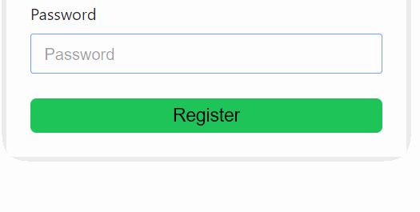
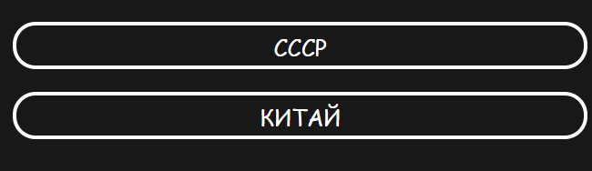
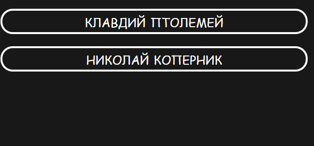

# Оценка текущего состояния ПО

Мы оценили наше ПО по следующим атрибутам качества:
- Распознаваемость соответствия
- Обучаемость
- Используемость (операбельность)
- Защита от ошибок пользователя
- Эстетика GUI
- Доступность

### 1. Распознаваемость соответствия
На данный момент пользователь может понять что из себя представляет игра только на этапе игры. Использование функционала проекта не доставляет неудобства пользователю. Побочные функции, которые не несут полезной нагрузки для приложения, отсутствуют.
### 2. Обучаемость
На данный момент обучаемость функционала высока. Пользователь, который хоть раз проходил викторины, сможет уже после первой игры изучить весь функционал приложения.
### 3. Используемость
На данный момент пользователь может контролировать все этапы выбора/создания викторины.
### 4. Защита от ошибок пользователя
Данный атрибут не выполнятся совсем. Пользователь может ввести пустое имя, ввести абсолютно любую почту и пароль.
### 5. Эстетика GUI
В интерфейсе преобладает зеленый цвет, что соответствует логотипу виткорины. Все основные страницы, а в особенности страница для прохождения викторин, имеют привлекательный внешний вид, который отличает наш продукт от аналогов.
### 6. Доступность
Web-приложение не учитывает особенности пользователей с ограниченными возможностями.Для работы с сайтом ночью или при слабом освещении в будущем планируется реализовать "ночной режим".

# Пути улучшения UX

Наиболее важным на данный момент является улучшения атрибута "Защита от ошибок пользователя", т. к. это ошибки, которые может допустить пользователь, могут поставить его в недоумение и не понимание текущей ситуации. Повышение соответствие данному атрибуту будет производиться введением следующим улучшением:

- Если пользователь будет пытаться войти с одним или несколькими пустыми полями, то ему будет выводиться сообщение об этом
- Пароль, введенный пользователем, должен быть достаточно длинным, чтобы пройти процесс регистрации

Также были добавлены различные анимации во время прохождения викторины для того, чтобы пользователю было приятнее проверять свои знания. Для этого у всех кнопок появилась своя анимация.

# Результаты

|До|После|Что изменили|
|---|---|---|
|||Обратная связь с пользователем, если поле Username пустое|
|||Появился фидбэк для пользователя|
|||Пользователь может видеть насколько его пароль сложный|
|||Добавлена анимация для неверного ответа|
|||Добавлена анимация для верного ответа|
|||Добавлена анимация  кнопка Next после ответа на вопрос|
|||Пользователь получает сообщение, что пароль слишком короткий, чтобы его использовать|

